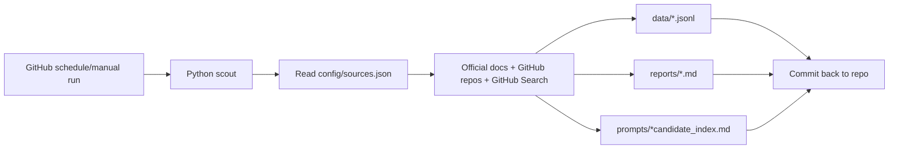

# Free Hosting Options - 2026-05-21

## Winner: GitHub Actions

Лучший вариант для этого сборщика: GitHub Actions в отдельном публичном репозитории.

Почему:

- cron запускается без включенного ПК;
- результаты можно коммитить обратно в repo;
- `GITHUB_TOKEN` доступен без ручного API-ключа;
- GitHub Search/API удобно подходит для prompt-repo discovery;
- весь history источников и находок остается в git.

Официальные документы:

- GitHub Actions billing and usage: https://docs.github.com/en/billing/concepts/product-billing/github-actions
- Scheduled workflows: https://docs.github.com/en/actions/how-tos/write-workflows/choose-when-workflows-run/events-that-trigger-workflows
- Workflow permissions: https://docs.github.com/actions/reference/workflows-and-actions/workflow-syntax

## Cloudflare Workers Cron Triggers

Подходит, если нужен легкий HTTP/cron worker. Минус: для постоянного хранения нужно отдельно подключать KV, D1 или R2, а это усложняет простой prompt-vault.

Официальные документы:

- Cron Triggers: https://developers.cloudflare.com/workers/configuration/cron-triggers/
- Platform limits: https://developers.cloudflare.com/workers/platform/limits/

## Vercel Cron Jobs

Подходит, если уже есть Vercel-приложение и хочется UI/API вокруг результатов. Для простого git-входящего я бы не выбирал первым: запись результатов в git придется делать отдельной логикой.

Официальный документ:

- Vercel Cron Jobs: https://vercel.com/docs/cron-jobs

## Netlify Scheduled Functions

Подходит, если проект уже живет на Netlify Functions. Для этой задачи слабее GitHub Actions, потому что нам важнее git-история и repo-native коммиты, чем serverless endpoint.

Официальный документ:

- Scheduled Functions: https://docs.netlify.com/build/functions/scheduled-functions/

## GitLab Scheduled Pipelines

Рабочий аналог GitHub Actions, если repo будет в GitLab. Минус: для пользователя здесь уже есть GitHub-oriented prompt/workflow контекст, поэтому GitHub проще.

Официальные документы:

- Scheduled pipelines: https://docs.gitlab.com/ci/pipelines/schedules/
- CI/CD minutes: https://docs.gitlab.com/ci/pipelines/cicd_minutes/

## Recommendation

Делать первую версию на GitHub Actions.

Схема:

